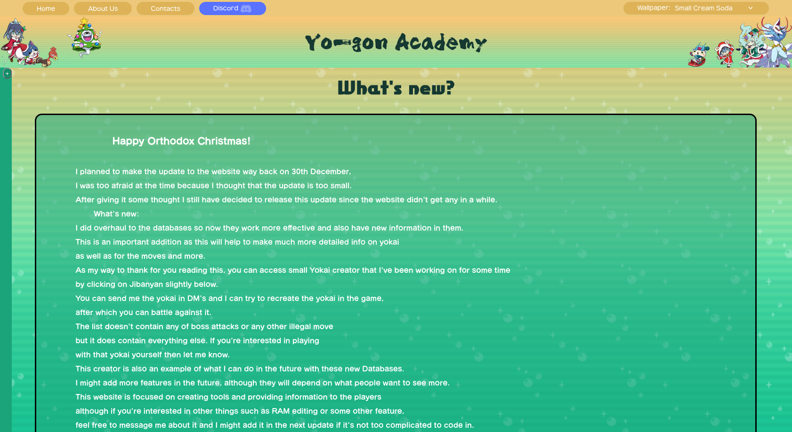

# Yo-Gon Academy

Yo-kai Watch 2 competitive info [via the web](https://hilwinnorm.github.io/YokaiWatchWebsite_Comp/).

## Purpose 
This website serves as a comprehensive resource for players, offering: 
- Advanced Yo-kai information
- Team building tools
- Damage Calculator
- Yo-kai rankings

Unlike other Yo-kai Watch resources, this website also provides:
- Yo-kai team builders for min-maxing teams
- Documentation of hidden or less-known mechanics
- Statistical breakdowns and performance metrics per-Yo-kai

## Site Roadmap 

- [ ] User accounts
- [ ] Community tier voting system
- [ ] Mobile app
- [ ] Multi-language support (?)
- [ ] Tournement hosting and stats storage
- [ ] Yo-kai Watch 3 support

## Contribution Guide

We accept any contributions to the project; be it code contribution, bug reports or simply spreading word of the site. 

To contribute code to the project, fork the project and create a pull request. Please ensure that the PR title is meaningful and the change has been tested before submission. Changes will not be accepted for the sake of change - changes should solve an issue, not changes for personal preference.

<b>Project info for developers</b>

    <ul>
        <li>index.html — Main entry point/homepage</li>
        <li>medallium.html — Lists all Yo-kai w/search options</li>
        <li>contact.html — Contact/credits page</li>
        <li>about.html — Web version of the README</li>
        <li>tierSheet.html — Yo-Gon's rankings</li>
        <li>TeamBuild.html — Yo-kai team builder </li>
        <li>PageNotFound.html — 404 page</li>
        <li>DamageCalc.html — Damage calcuator</li>
        <li>equipment.html — Lists equipment and soul gems</li>
        <li>YoKaiInfoPage.html — Individual Yo-kai info</li>
        <li>YokaiData.html — Yo-kai attacks and skills</li>
        <li>imageRecources — Links to external assets and resources</li>
        <li>YokaiCreator.html — Yo-kai teambuilder</li>
        <ul>
        <b>/Content/CSS:</b>
            <li>Main.css — Site-wide stylesheet. Planned to be depricated in favour of multiple ones</li>
            <li>TierSheet.css — Stylesheet used in tierSheet.html</li>
            <li>YokaiCreator.css — Stylesheet used in YokaiCreator.html</li>
            <b>/Content/JS/Databases</b> — various databases 
            <b>/Content/JS:</b>
            <li>MedalliumPageScript — used in medallium.html</li>
            <li>DamageCalc — used in DamageCalc.html</li>
            <li>Index.js — sitewide script for funcionality (e.g. wallpapers)</li>
            <li>ShowStats.js — used in YokaiInfoPage.html</li>
            <li>TeamBuild.js — used in TeamBuild.html</li>
            <li>MoveDataList.js — used in YokaiData.html</li>
            <li>YokaiCreator.js — used in YokaiCreator.html</li>
            <li>TierSheet.js — used in tiersheet.html</li>
            <b>Content/Graphics</b> — Images and other assets 
            <b>Content/Fonts</b> — Site fonts 
            <b>Content/Libs</b> — external dependancies
        </ul>
    </ul>

## Credits
- The Yo-gon Competitive community
- Code contributors

 

Built with ❤️ for the Yo-kai Watch competitive community

