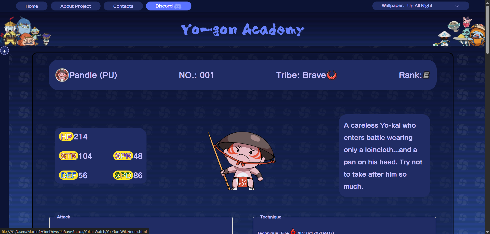

# Yo-Gon Academy

Yo-kai Watch 2 competitive info [via the web](https://hilwinnorm.github.io/YokaiWatchWebsite_Comp/).

## Purpose 
This website serves as a comprehensive resource for players, offering: 
- Advanced Yo-kai information
- Team building tools
- Damage Calculator
- Yo-kai rankings

Unlike other Yo-kai Watch resources, this website also provides:
- Yo-kai team builders for min-maxing teams
- Documentation of hidden or less-known mechanics
- Statistical breakdowns and performance metrics per-Yo-kai

## Site Roadmap 

- [ ] User accounts
- [ ] Community tier voting system
- [ ] Mobile support
- [ ] Multi-language support (?)
- [ ] Tournament hosting and stats storage
- [ ] Yo-kai Watch 3 support

## Contribution Guide

We accept any contributions to the project; be it code contribution, bug reports or simply spreading word of the site. 

To contribute code to the project, fork the project and create a pull request. Please ensure that the PR title is meaningful and the change has been tested before submission. Changes will not be accepted for the sake of change - changes should solve an issue, not changes for personal preference.

<b>Project info for developers</b>

    <ul>
        <li>index.html — Main entry point/homepage</li>
        <li>contact.html — Contact/credits page</li>
        <li>about.html — Web version of the README</li>
        <li>medallium.html — Lists all Yo-kai w/search options</li>
        <li>damage-calculator.html — Damage calcuator</li>
        <li>yokai-info.html — Individual Yo-kai info</li>
        <li>move-info.html — Individual Battle Command info</li>
        <li>skill-info.html — Individual Ability info</li>
        <li>item-info.html — Individual Equipment info</li>
        <li>misc-info.html — Individual misc. Item info</li>
        <li>team-builder.html — Yo-kai team builder </li>
        <li>tier-sheet.html — Yo-Gon's rankings</li>
        <li>equipment-list.html — Lists equipment and soul gems</li>
        <li>move-list.html — Yo-kai attacks and skills</li>
        <li>misc-list.html — Lists all Items</li>
        <li>image-recources.html — Links to external assets and resources</li>
        <li>page-not-found.html — 404 page</li>
        <li>yokai-creator.html — Yo-kai Creator **(Deprecated)**</li>
        <ul>
        <b>/Content/CSS:</b>
            <li>main.css — Site-wide stylesheet. Planned to be depricated in favour of multiple ones</li>
            <li>info-list-style.css — Site-wide stylesheet used for listing pages</li>
            <li>damage-calculator.css — Stylesheet used in damage-calculator.html</li>
            <li>equipment.css — Stylesheet used in equipment-list.html</li>
            <li>medallium.css — Stylesheet used in medallium.html</li>
            <li>team-builder.css — Stylesheet used in team-builder.html</li>
            <li>item-data.css — Stylesheet used in item-info.html</li>
            <li>tier-sheet.css — Stylesheet used in tier-sheet.html</li>
            <li>yokai-creator.css — Stylesheet used in yokai-creator.html</li>
            <li>profile-menu.css — Stylesheet used in profile.html</li>
            <li>yokai-info-page.css — Stylesheet used in yokai-info.html</li>
            <b>/Content/JS/Databases</b> — various databases 
            <b>/Content/JS:</b>
            <li>medallium-script.js — used in medallium.html</li>
            <li>damage-calculator.js — used in damage-calculator.html</li>
            <li>main.js — sitewide script for funcionality (e.g. wallpapers)</li>
            <li>yokai-data.js — used in yokai-info.html</li>
            <li>item-data.js — used in item-info.html</li>
            <li>move-data.js — used in move-info.html</li>
            <li>skill-data.js — used in move-info.html</li>
            <li>team-builder.js — used in team-builder.html</li>
            <li>equipment-list.js — used in equipment-list.html</li>
            <li>move-list.js — used in move-list.html</li>
            <li>misc-item-list.js — used in misc-list.html</li>
            <li>yokai-creator.js — used in yokai-creator.html</li>
            <li>tier-sheet.js — used in tier-sheet.html</li>
            <li>platform.js — currently unused. Exports data about user's platform</li>
            <b>Content/Graphics</b> — Images and other assets 
            <b>Content/Fonts</b> — Site fonts 
            <b>Content/Libs</b> — external dependancies
        </ul>
    </ul>

## Credits
- The Yo-gon Competitive community
- Code contributors

 

Built with ❤️ for the Yo-kai Watch competitive community
